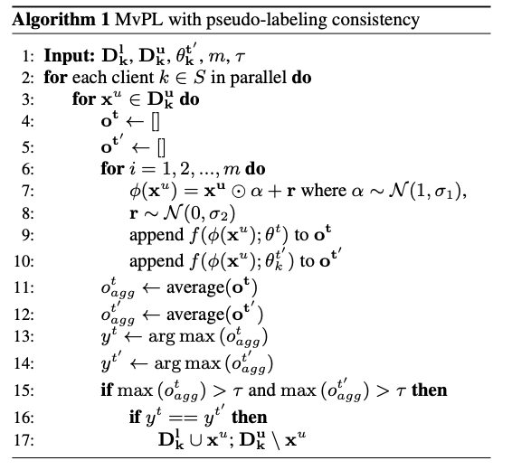
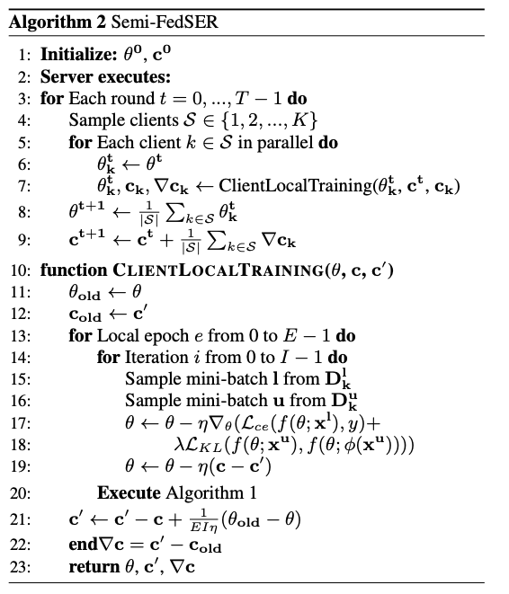

# Semi-FedSER: Semi-supervised Learning for Speech Emotion Recognition OnFederated Learning using Multiview Pseudo-Labeling
This repository contains the official implementation (in [PyTorch](https://pytorch.org/)) of [Semi-FedSER](https://github.com/usc-sail/fed-ser-semi/blob/main/paper.pdf).


## Speech Features

We extract a variety of speech representations using OpenSMILE toolkit and pretrained models. You can refer to [OpenSMILE](https://www.audeering.com/research/opensmile/) and [SUPERB](https://arxiv.org/abs/2105.01051) paper for more information.

Below is a listed of features that we include in the current experiment:

Publication Date | Model | Name | Paper | Input | Stride | Pre-train Data | Official Repo 
|---|---|---|---|---|---|---|---
--- | EmoBase | --- | [MM'10](https://dl.acm.org/doi/10.1145/1873951.1874246) | Speech | --- | --- | [EmoBase](https://www.audeering.com/research/opensmile/)
5 Apr 2019 | APC | apc | [arxiv](https://arxiv.org/abs/1904.03240) | Mel | 10ms | [LibriSpeech-360](http://www.openslr.org/12) | [APC](https://github.com/Alexander-H-Liu/NPC)
12 Jul 2020 | TERA | tera | [arxiv](https://arxiv.org/abs/2007.06028) | Mel | 10ms | [LibriSpeech-960](http://www.openslr.org/12) | [S3PRL](https://github.com/andi611/Self-Supervised-Speech-Pretraining-and-Representation-Learning)
Dec 11 2020 | DeCoAR 2.0 | decoar2 | [arxiv](https://arxiv.org/abs/2012.06659) | Mel | 10ms | [LibriSpeech-960](http://www.openslr.org/12) | [speech-representations](https://github.com/awslabs/speech-representations)

## Federated Learning Overview

Let's recap the basic of the FL. 

1. In a typical FL training round shown in the figure below, a subset of selected clients receive a global model, which they can locally train with their private data. 

2. Afterward, the clients only share their model updates (model parameters/gradients) to the central server. 

3. Finally, the server aggregates the model updates to obtain the global model for the next training round. 


## Challenge in FL

One major challenge in FL is that high-quality labeled data samples do not often exist, and most data samples are indeed unlabeled. To address this, Semi-FedSER performs the model training, utilizing both labeled and unlabeled data samples at the local client. 

Semi-FedSER also incoporate with pseudo-labeling using the idea of multiview pseudo-labeling, and we adopt an efficient yet effective data augmentation technique called: Stochastic Feature Augmentation (SFA). The algorithm of the pseudo-labeling process is below.
<p align="center"></p>

In order to further address the gradient drifting issue in non-IID setting of FL, we add the implementation of SCAFFOLD. The final training algorithm is below.
<p align="center"></p>

## Final SER performance


## Other Referecences


**[OpenSMILE](https://www.audeering.com/research/opensmile/)**
```
@inproceedings{eyben2010opensmile,
  title={Opensmile: the munich versatile and fast open-source audio feature extractor},
  author={Eyben, Florian and W{\"o}llmer, Martin and Schuller, Bj{\"o}rn},
  booktitle={Proceedings of the 18th ACM international conference on Multimedia},
  pages={1459--1462},
  year={2010}
}
```

**[SUPERB](https://arxiv.org/abs/2105.01051)**

```
@inproceedings{yang21c_interspeech,
  author={Shu-wen Yang and Po-Han Chi and Yung-Sung Chuang and Cheng-I Jeff Lai and Kushal Lakhotia and Yist Y. Lin and Andy T. Liu and Jiatong Shi and Xuankai Chang and Guan-Ting Lin and Tzu-Hsien Huang and Wei-Cheng Tseng and Ko-tik Lee and Da-Rong Liu and Zili Huang and Shuyan Dong and Shang-Wen Li and Shinji Watanabe and Abdelrahman Mohamed and Hung-yi Lee},
  title={{SUPERB: Speech Processing Universal PERformance Benchmark}},
  year=2021,
  booktitle={Proc. Interspeech 2021},
  pages={1194--1198},
  doi={10.21437/Interspeech.2021-1775}
}
```